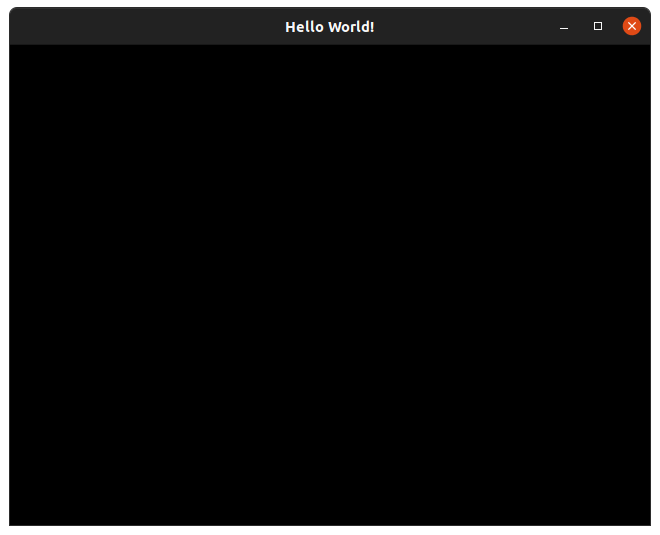
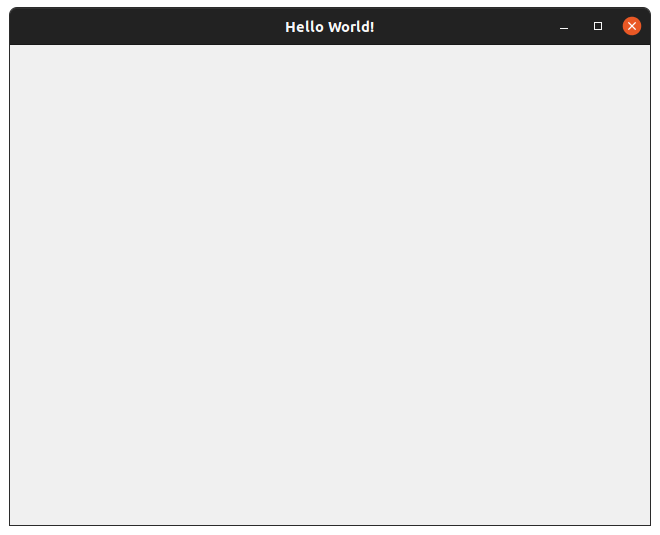
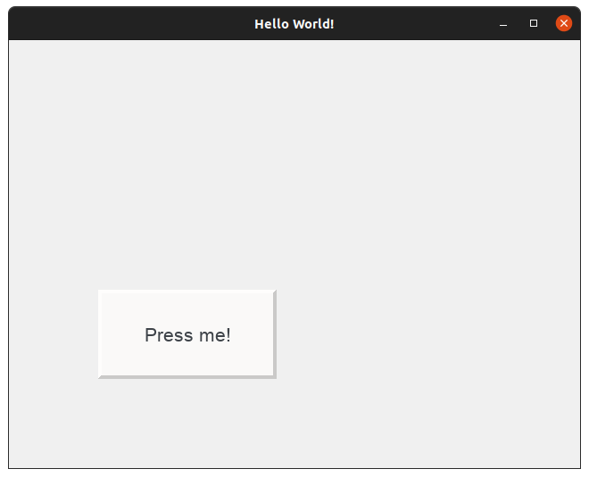

Quickstart
==========

In this guide, we will learn how to create a simple GUI using ``peng3d``\ .

.. seealso::
   For a more complex example, see :doc:`3d-app/index`\ .

Basic Structure
---------------

In this guide, we will be writing our app using only a single Python file for simplicity.
For more complex projects, it is recommended to split your application by menus or even submenus
into different files.

First, here's the minimum example required to show anything with ``peng3d``::

   import peng3d

   peng = peng3d.Peng()

   peng.createWindow(caption="Hello World!", resizable=True)

   main_menu = peng3d.Menu("main", peng.window, peng)
   peng.window.addMenu(main_menu)

   peng.window.changeMenu("main")
   peng.run()

If you run the app now, you should see a black window with a title of ``Hello World!``\ :

While most of the lines should be fairly self-explanatory, let's go through them one by one.

First, we start by importing ``peng3d`` and creating an instance of the :py:class:`peng3d.Peng()` class::

   import peng3d

   peng = peng3d.Peng()

There should only be one instance of this class per app, shared between all components.
It manages the event system and some other globally shared resources.

Next, we create our window with the desired caption::

   peng.createWindow(caption="Hello World!", resizable=True)

Since we want to keep this example very simple, we only pass a caption and activate resizing.
All arguments to :py:meth:`Peng.createWindow()` are optional and should be passed as keyword
arguments. Any arguments not recognized by ``peng3d`` are passed through to the underlying
:py:class:`PengWindow` class, which will in turn pass through unrecognized arguments to
``pyglet``\ .

.. seealso::
   See the :py:mod:`pyglet.window` module docs for a list of all arguments.

Now that we have created our window, we'll create our first menu and register it::

   main_menu = peng3d.Menu("main", peng.window, peng)
   peng.window.addMenu(main_menu)

The basic :py:class:`Menu` class is designed for layer-based rendering. We will later change
this, since we want to create a GUI with widgets.

Also, we always need to register menus (and later also submenus and widgets), so it is a
good practice to always register a menu right after creating it.

Lastly, we'll switch to our main menu and start the application::

   peng.window.changeMenu("main")
   peng.run()

The call to :py:meth:`changeMenu()` can be used to switch between different menus, here
we use it to define which menu our app starts with. Note that we pass in the name of our menu,
not the menu object itself.

The final call to ``peng.run()`` starts the internal event loop of pyglet and blocks until
the application exits, usually by clicking the X button.

.. note::
   The code described in this subsection can also be found in ``examples/quickstart/quickstart_basic.py`` `here <https://github.com/not-na/peng3d/tree/master/examples/quickstart/quickstart_basic.py>`_\ .

Creating our first widget
-------------------------

Now that we have a basic skeleton running, let's add some actual functionality. We'll modify the code from
the previous subsection bit by bit.

First, lets switch to a more advanced :py:class:`GUIMenu` instead of the simple :py:class:`Menu` we used earlier.

.. note::
   For most widget-oriented apps, this is what you'll use, although custom 3D canvases usually
   use a plain :py:class:`Menu` with a :py:class:`GUILayer` for overlayed widgets.

To do this, we'll first change the class name::

   main_menu = peng3d.GUIMenu("main", peng.window, peng)

Then, let's set the background to a more appealing color. For now, we'll use a light grey,
although many more variants are possible. You could even use an image or a custom callback
as a background. To set the background, simply call :py:meth:`GUIMenu.setBackground` with the
color you want::

   main_menu.setBackground([240, 240, 240])

By setting the background in the menu instead of the submenu, all submenus of this menu
will automatically inherit the background unless they overwrite it. This makes it easier
to e.g. swap themes.

If you try to run the app now, you'll notice that it won't start. This is because :py:class:`GUIMenu` menus
require an active submenu at all times that they are active. So, let's add a submenu and register it::

   main_main = peng3d.SubMenu("main_sub", main_menu, peng.window, peng)
   main_menu.addSubMenu(main_main)

While it may not matter much in this simple app, we have chosen a name for this submenu
that is different from the main menu. Any string can be used as a name, so feel free to
create your own naming convention.

.. note::
   While submenus of different menus could have identical names, this is strongly discouraged,
   as it can lead to confusion in larger projects. Ideally, each named object should have
   a unique name.

We'll also have to tell the main menu to use this submenu, just before it is activated itself::

   main_menu.changeSubMenu("main_sub")

If you run the app now, you should see a grey window instead of a black window:

Now, this is a bit better than just a black window, but not by much. Let's go a bit further
and add a single button that prints whenever it is clicked.

To do this, we'll have to first create the button and register it::

   button = peng3d.Button("btn", main_main, peng.window, peng,
                          pos=[100, 100],
                          size=[200, 100],
                          label="Press me!",
                          borderstyle="oldshadow",
                          )
   main_main.addWidget(button)

The :py:class:`Button` class takes a lot of arguments, so let's go over them.

In the first line, we pass the name of the button. Here, the same caveats apply as with submenu
and menu names. We also pass the submenu this widget belongs to, as well as a reference
to the window and :py:class:`Peng` singleton.

In the next two lines, we pass the position and size of the widget.

.. note::
   Positions in ``peng3d`` widgets are always from the bottom-left corner of the screen.
   Both positions and sizes are in pixels.

Next, we pass the label. For now, we give it a static label, though ``peng3d`` also supports
easy translation capabilities.

Lastly, we pass what style of border to use. There are several border styles available, further
information is available in the documentation of the :py:class:`~peng3d.gui.button.Button` class.

.. seealso::
   There are many more optional arguments that the :py:class:`~peng3d.gui.button.Button` class
   can take. See the API documentation for details.

Now, we have a button. But it does not do anything yet, so let's add an action that prints
something whenever it is called::

   button.addAction("click", print, "Clicked!")

The :py:meth:`addAction()` method is quite flexible. It takes the name of the action
as the first parameter, a function to call as the second parameter and passes all other arguments
to each call of the function. So while we could write a one-line function to print out our
message, we can just pass the argument to print. Obviously, you'll still have to write
proper functions or methods for more complicated handlers.

Now, let's take a look at our current app:

If you run the app yourself, try clicking on the button and watching the console output. You
should see ``Clicked!`` every time you release the button.

If you want, try playing around with the parameters to the :py:class:`Button` class and see
how they effect the look or behaviour of the app.

Once you are done, move on to the next subsection, where we learn how to use and switch
between multiple menus.

.. note::
   The code described in this subsection can also be found in ``examples/quickstart/quickstart_widget.py`` `here <https://github.com/not-na/peng3d/tree/master/examples/quickstart/quickstart_widget.py>`_\ .

Switching between menus
-----------------------

.. todo::
   Write this subsection

Dynamically adjusting our layout to the window size
---------------------------------------------------

.. todo::
   Write this subsection

Further reading
---------------

There are other, more advanced guides available. For example, take a look at :doc:`3d-app/index`\ .

.. seealso::
   See the ``examples/`` folder on the `main repository <https://github.com/not-na/peng3d/tree/master/examples>`_
   for more examples of various ``peng3d`` features.